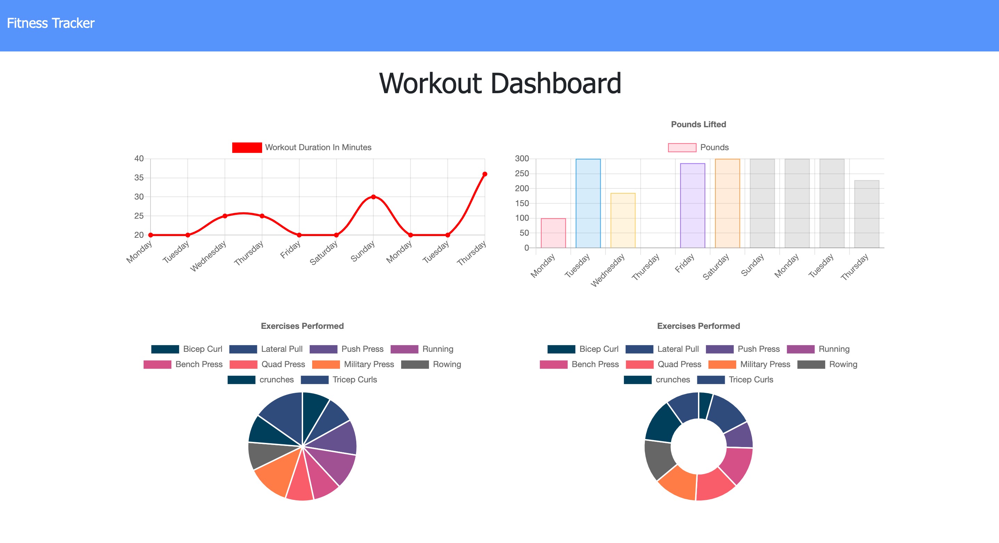
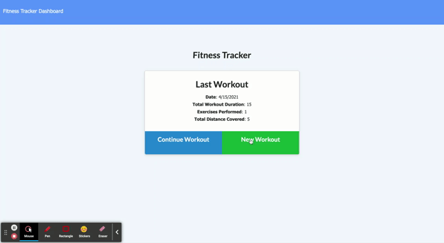

# myFitnessTracker# My FitnessTracker

  ## Badge

  

  ## Description

  An application for tracking your daily fitness routine!

View the deployed app [here](https://shrouded-retreat-52814.herokuapp.com/)!

  
  ## Table of Contents
  
  - [Installation](#Installation)
  - [Usage](#Usage)
  - [Credits](#Credits)
  - [Contributing](#Contributing)
  - [Test](#Tests)
  - [Questions](#Questions)
  - [License](#License)
  
  ## Installation

  ```bash
  First, clone the repo, then save in desired location.
  ```

  [Back to Table of Contents](#table-of-contents)
  
  ## Usage

  In your console/terminal, run the command npm i to install dependencis.  Next (optional) run 'npm run seed' to seed the database.  Finally, run NPM start to start the server and run the application in your local environment!



  [Back to Table of Contents](#table-of-contents)
  
  ## Credits

  This app was created with mongoDB, mongoose, express, morgan, and is powered by JavaScript.

  [Back to Table of Contents](#table-of-contents)
  
  ## Contributing
  
  Please review the community standards for contributing to this project, adopted from the [Contributor Covenant](https://www.contributor-covenant.org/).

  [Back to Table of Contents](#table-of-contents)
  
  ## Tests

  ```bash
  No tests at this time.
  ```

  [Back to Table of Contents](#table-of-contents)
  
  ## Questions
  
  Questions? You can reach me by email at jennifer.nelson242@gmail.com. Feel free to check out additional projects at [my GitHub profile](https://github.com/jnel-221).

  [Back to Table of Contents](#table-of-contents)
  
  ## License

  This project is licensed under the terms of the MIT license.
  
  [Back to Table of Contents](#table-of-contents)